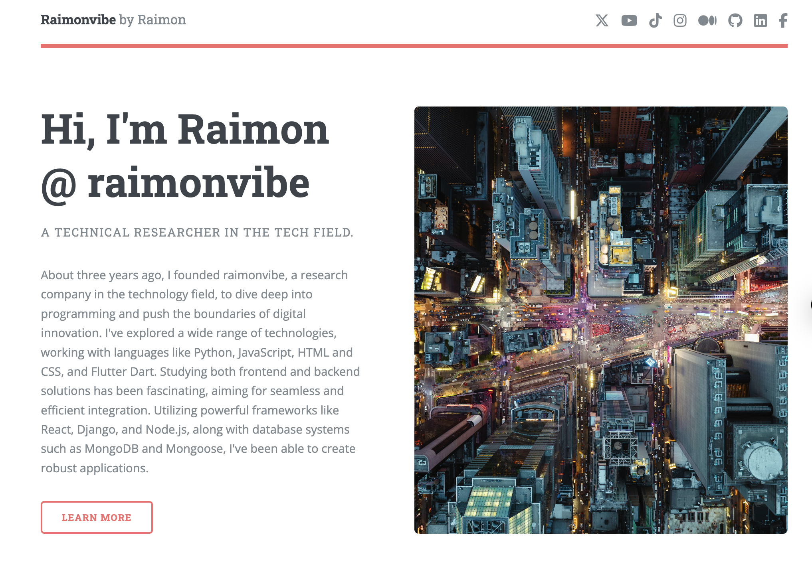

# 🇪🇺 Website Editorial EU



A modern editorial-style website built with **Next.js**, **Tailwind CSS**, and **TypeScript**. This project is designed for creating sleek, accessible, and fast-loading editorial sites for European content creators, publishers, or organizations.

🌍 **Live Website:** [raimonvibe.eu](https://www.raimonvibe.eu/)
---

## ✨  Features

- ⚡ Fast and lightweight using Next.js
- 🎨 Styled with Tailwind CSS and fully responsive
- 🔤 Multilingual-ready for European audiences
- 🧩 Modular design system
- 🛠️ TypeScript for type safety and better DX
- 🌐 Deployed via Vercel for global speed

---

## 🚀 Getting Started

### Prerequisites

- Node.js 18+
- npm or yarn

### Installation

```bash
git clone https://github.com/raimonvibe/website-editorial-eu.git
cd website-editorial-eu
npm install
npm run dev
```

Open [http://localhost:3000](http://localhost:3000) to view it in your browser.

---

## 🗂️ Project Structure

- `src/app` – Next.js App Router routes and pages
- `src/components` – Reusable React components
- `src/data` – Content and data modules
- `src/styles` – Global and modular styles
- `public` – Static assets

---

## 📦 Deployment

This project is optimized for deployment on [Vercel](https://vercel.com).

---

## 🤝 Contributing

See [CONTRIBUTING.md](CONTRIBUTING.md) for setup and pull request tips. Good first issues are labeled [`good first issue`](https://github.com/raimonvibe/website-editorial-eu/labels/good%20first%20issue).

---

## 🧠 Credits

Built and maintained by [raimonvibe](https://github.com/raimonvibe)

---

## 📄 License

MIT License – feel free to use, modify, and share.
